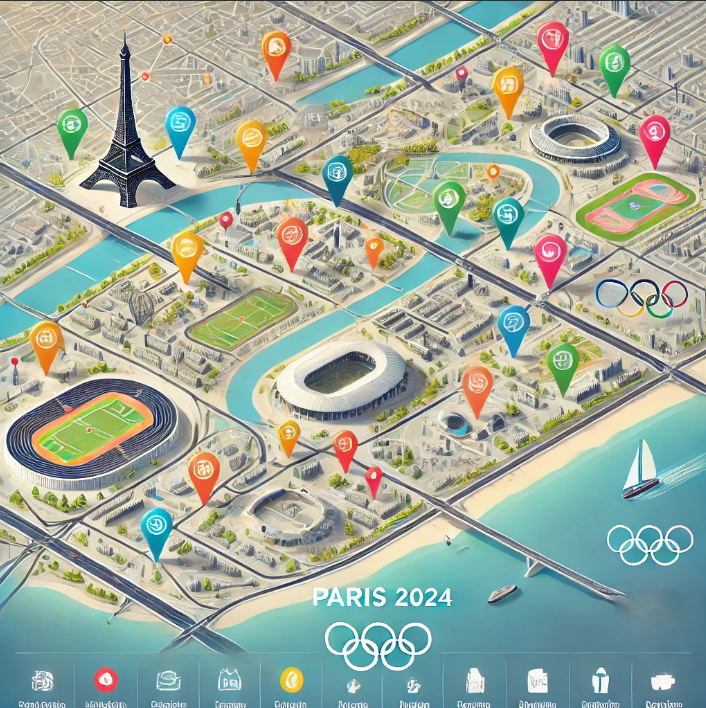
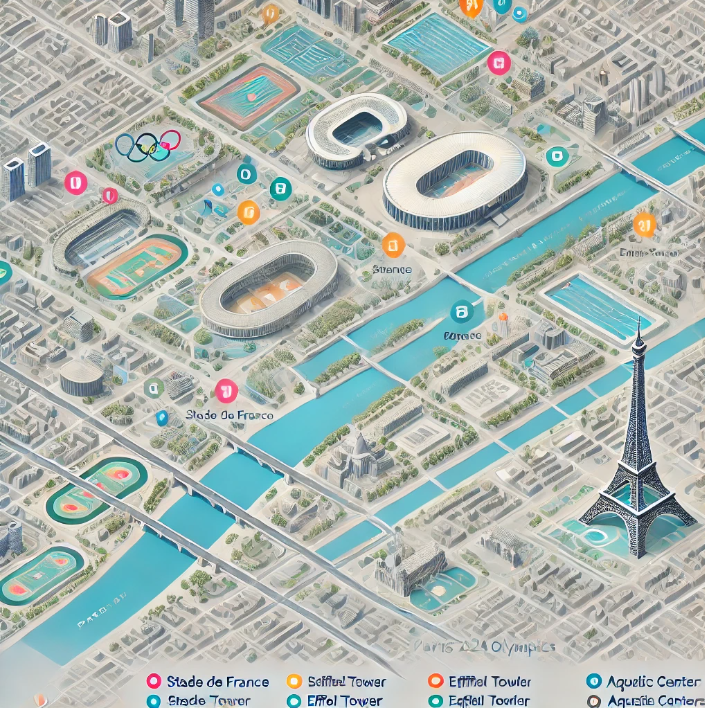
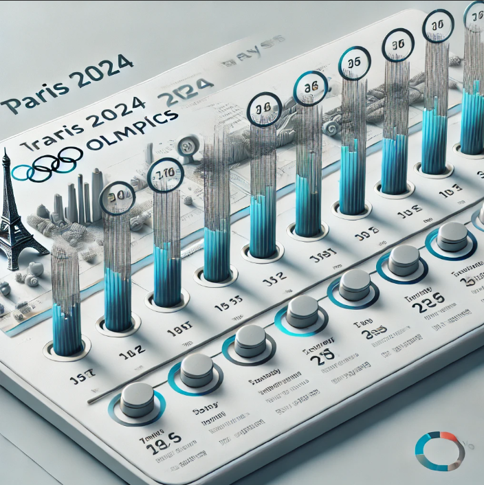
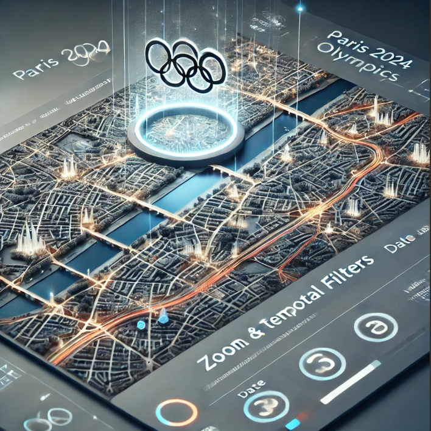
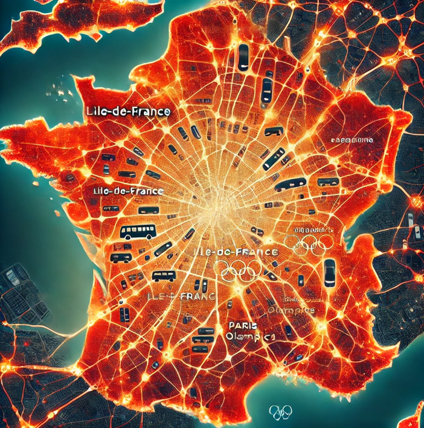

# Cahier d’avancement pour le Projet de Data Visualisation : Jeux Olympiques Paris 2024

### Équipe :

- Adam El Abed
- Hayet Danoun
- Hawa Fofana
- Selma Koudia

### Dates clés :

- **Date de début** : 03/12/2024
- **Date prévue de fin** : 24/01/2025

---

## **Phase 1 : Préparation et Exploration Initiale (03/12/2024 – 25/12/2024)**

### Sujet initial :

- **Objectif** : Visualiser les données personnelles issues de Google Maps.
- **Problème rencontré** : Données indisponibles en raison de l’absence d’activation de la sauvegarde des trajets sur Google Maps.



### Redéfinition du sujet :

- **Nouveau sujet** : Visualisation des flux de mobilité pendant les Jeux Olympiques Paris 2024.
- **Contexte** : Les Jeux Olympiques posent des défis uniques en termes de gestion de la mobilité et des infrastructures de transport en Île-de-France.



### Recherche et collecte des données :

- **Sources principales explorées** :
  - Portail officiel Data.gouv.fr.
  - Île-de-France Mobilités.
  - Site jo.fabmob.io (cerémonie d’ouverture).
- **Problème rencontré** : Données en accès restreint ou non disponibles.
- **Solution adoptée** : Récupération manuelle des données depuis le site jo.fabmob.io/ceremonie_ouverture.

### Exploration initiale des données :

- **Focus initial** :
  - Étude géographique de la répartition des spectateurs lors de la cérémonie d’ouverture.
  - Analyse des flux attendus vers les sites olympiques.
- **Outils choisis** :
  - **D3.js** : Création de graphiques interactifs.
  - **Leaflet** : Conception de cartes dynamiques et interactives.

### Premiers travaux :

- **Design initial** :
  - Représentation des flux de spectateurs sous forme de graphiques et cartes simples.
- **Prototypage** :
  - Création d’une carte statique des sites olympiques avec Leaflet.
  - Préparation de données manuelles pour tester des visualisations préliminaires.



---

## **Phase 2 : Nettoyage des données et amélioration des visualisations (25/12/2024 – 06/01/2025)**

### Structuration et préparation des données :

- **Étapes réalisées** :
  - Nettoyage et structuration des données manuelles récupérées.
  - Conversion des données en formats compatibles avec D3.js et Leaflet (JSON, GeoJSON).
- **Problème rencontré** :
  - Volume limité des données disponibles.
- **Solution** : Génération de données synthétiques basées sur des hypothèses réalistes pour enrichir les visualisations.

### Développement des visualisations :

- **Améliorations apportées** :
  - Ajout d’interactions à la carte :
    - Zoom sur des zones spécifiques.
    - Survol des données pour afficher des détails supplémentaires.
  - Exploration de différents types de graphiques (histogrammes, flux par zones géographiques).
- **Problèmes rencontrés** :
  - Difficulté d’intégration des interactions avancées entre D3.js et Leaflet.
  - Performance limitée avec un trop grand nombre d’éléments interactifs affichés.
- **Solutions envisagées** :
  - Optimisation des interactions en limitant le nombre d’éléments visibles.
  - Mise en place de filtres temporels et géographiques pour améliorer la fluidité.

## 

## **Phase 3 : Finalisation et documentation (06/01/2025 – 24/01/2025)**

### Finalisation des visualisations :

- **Travaux réalisés** :
  - Intégration complète de D3.js et Leaflet pour des graphiques et cartes entièrement interactifs.
  - Ajout de légendes, annotations et titres pour améliorer la compréhension des visualisations.
  - Vérification des performances pour garantir une navigation fluide et une réactivité optimale.
- **Fonctionnalités clés** :
  - Sliders temporels pour visualiser les flux de mobilité à différentes périodes.
  - Cartes thermiques des zones saturées pendant les heures de pointe.
  - Graphiques dynamiques avec zoom et mise à jour en temps réel via JSON.



### Documentation et présentation :

- **Rapport** :
  - Explication des choix méthodologiques, notamment le passage aux données synthétiques et les outils utilisés.
  - Analyse des limitations rencontrées et des solutions apportées.
- **Démonstration interactive** :
  - Préparation d’une présentation pour les enseignants et les pairs, mettant en avant les fonctionnalités interactives.
- **Corrections apportées** :
  - Intégration des remarques reçues lors des phases de validation intermédiaires.
  - Ajustements des visuels pour une meilleure lisibilité et clarté.

---

## **Synthèse des résultats**

### Réalisations majeures :

1. **Visualisations interactives** :
   - Cartes interactives des sites olympiques avec affichage des flux.
   - Graphiques dynamiques présentant les modes de transport, les distances et les heures de déplacement.
2. **Accessibilité** :
   - Navigation intuitive et design responsive grâce à l’utilisation conjointe de D3.js et Leaflet.
3. **Impact** :
   - Propositions pour une meilleure gestion des flux de spectateurs et une promotion de la mobilité durable.

---

## **Annexes**

### Sources de données :

- Données manuelles issues de : [jo.fabmob.io/ceremonie_ouverture](https://jo.fabmob.io/ceremonie_ouverture).

### Outils documentés :

- **D3.js** : Documentation officielle pour les graphiques interactifs.
- **Leaflet** : Documentation pour les cartes interactives basées sur GeoJSON.

### Perspectives :

- Intégrer de nouvelles données lorsque disponibles via des API officielles.
- Étendre le projet à d’autres aspects des Jeux Olympiques (logistique, hébergement, etc.).

---

```

```
